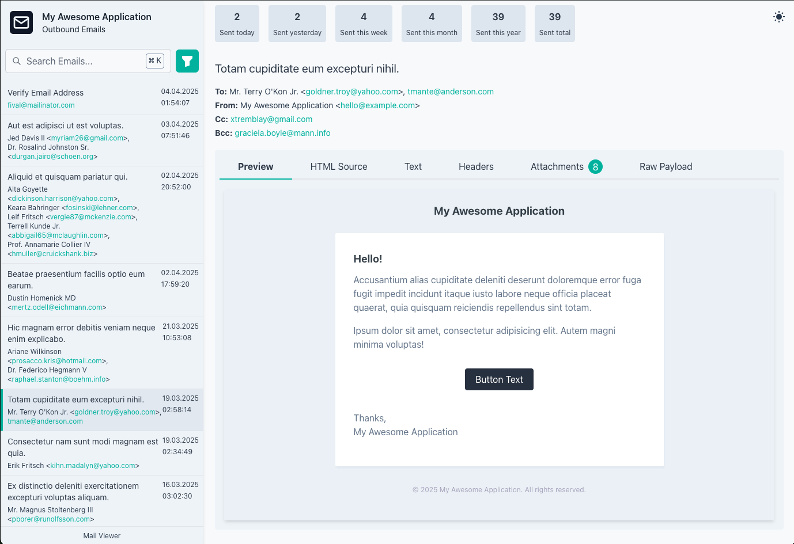
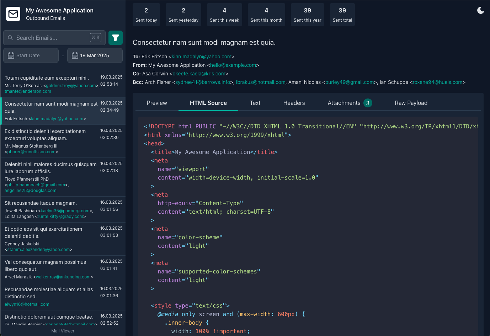

<p align="center">
    
</p>

<p align="center">
    <a href="https://packagist.org/packages/masterro/laravel-mail-viewer">
        
    </a>
    <a href="https://packagist.org/packages/masterro/laravel-mail-viewer">
        
    </a>
    <a href="https://github.com/MasterRO94/laravel-mail-viewer/blob/master/LICENSE">
        
    </a>
</p>

<p align="center">
    <a href="https://github.com/vshymanskyy/StandWithUkraine/blob/main/docs/README.md">
        
    </a>
</p>

# Laravel Mail Logger & Viewer

Easily log, view, and search outgoing emails directly in your browser.




This package logs all outgoing emails to a database and provides a web interface to view them, formatted as they appear in modern email clients like Gmail.

---

## Installation

### Step 1: Install via Composer

Run the following command in your terminal:

```sh
composer require masterro/laravel-mail-viewer
```

### Step 2: Publish Assets & Configurations

```sh
php artisan mail-viewer:publish
```

### Step 3: Run Migrations

```sh
php artisan migrate
```

### Step 4: View Emails

Visit `/_mail-viewer` in your browser to access the email viewer.

> **Note:** The route can be customized in the configuration file.

---

## Configuration

You can adjust default settings in the `config/mail-viewer.php` file.

### Data Pruning

The package supports Laravel's [Model Pruning](https://laravel.com/docs/eloquent#pruning-models). Define how many days emails should be retained in the configuration:

```php
'prune_older_than_days' => 365,
```

---

## Production Usage

By default, the email viewer is publicly accessible. 
In a production environment, it's highly recommended to restrict access 
using middleware or something like [Access Screen](https://github.com/MasterRO94/laravel-access-screen) package.

### Restrict Access with Middleware

Modify your `routes/web.php` to apply authentication:

```php
'middleware' => ['web', 'can:viewMailLogs'],
```

You can also limit access by IP address in `App\Http\Middleware\RestrictMailViewerAccess.php`:

```php
namespace App\Http\Middleware;

use Closure;
use Illuminate\Http\Request;

class RestrictMailViewerAccess
{
    public function handle(Request $request, Closure $next)
    {
        if (!in_array($request->ip(), ['127.0.0.1', '::1', 'YOUR_ALLOWED_IP'])) {
            abort(403);
        }

        return $next($request);
    }
}
```

Apply it in config:

```php

'middleware' => ['web', RestrictMailViewerAccess::class],
```

Now, only authorized users or allowed IPs can access the mail viewer.

---

## License

This package is open-source software licensed under the [MIT license](LICENSE).

---

## Credits

Developed by [MasterRO](https://github.com/MasterRO94).

